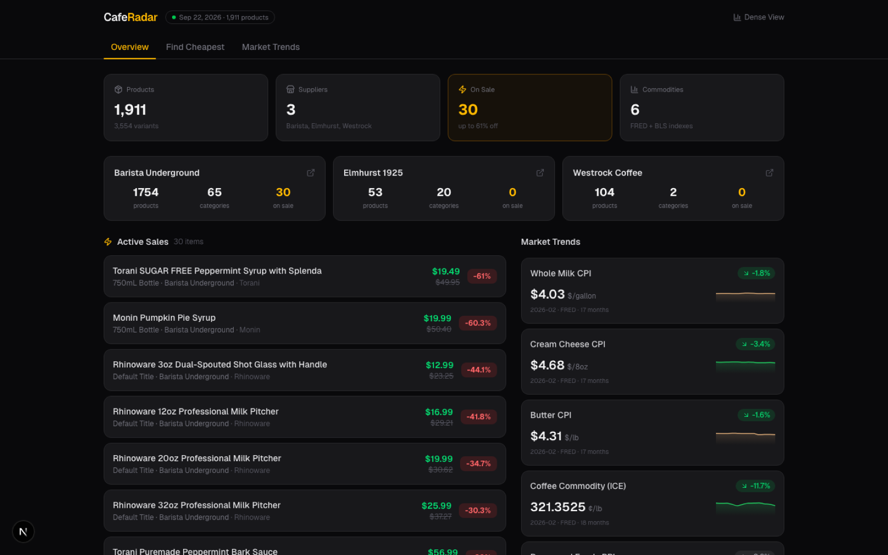
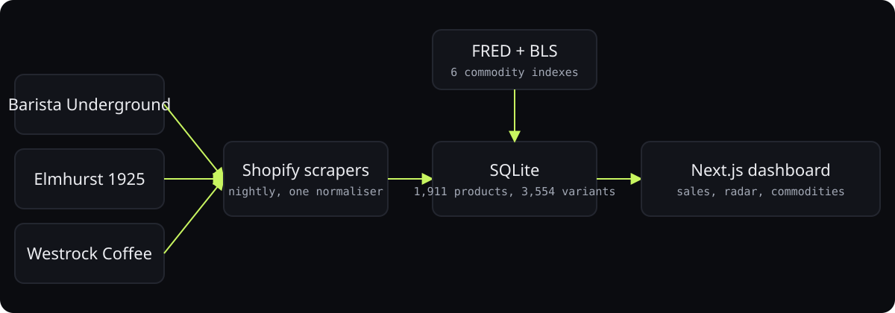
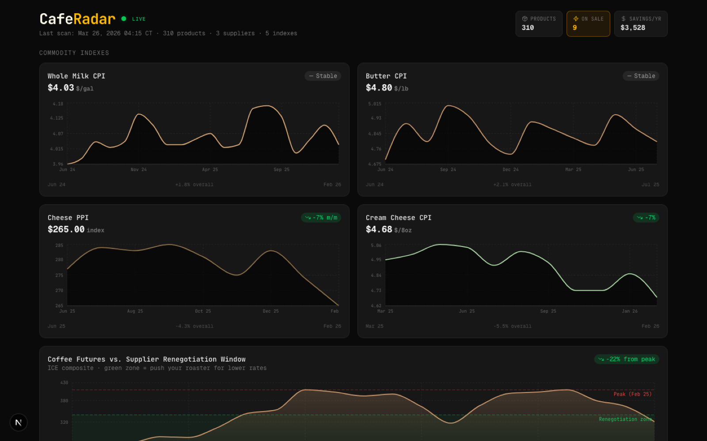
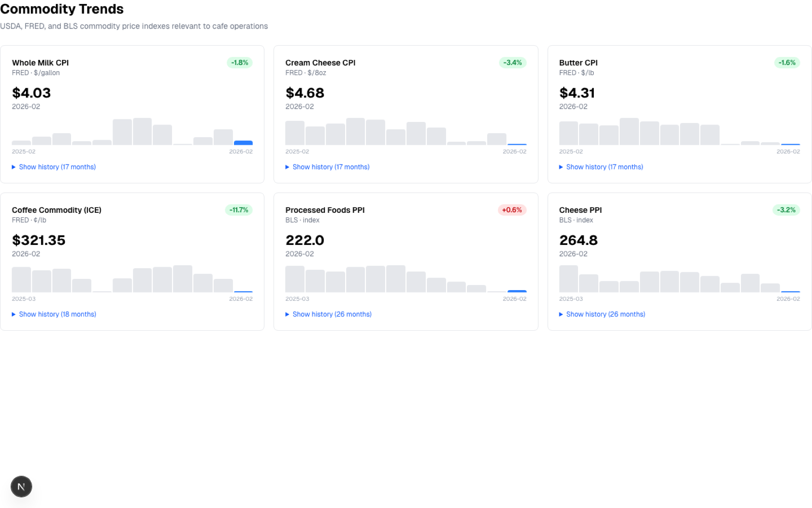

<div align="center">



# CafeRadar

**Price intelligence for a cafe: scrapes three suppliers nightly and overlays commodity indexes so the owner knows when to renegotiate.**

<p>
<a href="https://ibiraheel.com/p/caferadar"></a>
</p>

<p>


</p>

</div>

<br>

> **1,911 products and 6 commodity indexes tracked**  
> for a cafe owner buying from Barista Underground, Elmhurst, and Westrock

## What it did

Nightly scrapers pull 3,554 variants into SQLite, flag sales up to 61% off, and chart FRED and BLS indexes for milk, butter, cheese, and coffee futures against a supplier renegotiation window.

<sub>Outcome: measured.</sub>

## How it works

<p align="center"></p>

1. Shopify storefront scrapers share one normaliser, so a new supplier is one small file.
2. SQLite in the repo: no server to run, and the whole history travels with the code.
3. Commodity data from FRED and BLS is joined to products by category so a price move has context.
4. Next.js App Router pages read through a single queries module.

## Screenshots

<table>
<tr>
<td width="50%"><br><sub>Commodity radar with renegotiation zone</sub></td>
<td width="50%"><br><sub>Commodity indexes</sub></td>
</tr>
<tr>
<td width="50%"><br><sub>Dashboard</sub></td>
</tr>
</table>

## Run it locally

```bash
npm install
npm run dev    # http://localhost:3000, reads the bundled data/prices.db
npm run seed   # optional: re-scrape the suppliers and commodity indexes into a fresh DB
```

## Repository layout

```
├── data/
│   ├── prices.db
│   ├── prices.db-shm
│   └── prices.db-wal
├── public/
│   ├── file.svg
│   ├── globe.svg
│   ├── next.svg
│   ├── vercel.svg
│   └── window.svg
├── scripts/
│   └── seed.ts
├── src/
│   ├── app/
│   └── lib/
├── AGENTS.md
├── CLAUDE.md
├── eslint.config.mjs
├── next-env.d.ts
├── next.config.ts
├── package.json
├── postcss.config.mjs
├── README.md
└── tsconfig.json
```

---

<div align="center">

<sub>Built by <a href="https://github.com/ibi-raheel">Muhammad Ibrahim Raheel</a> · more work at <a href="https://ibiraheel.com">ibiraheel.com</a></sub>

</div>
